# VSDOpen21_FPGA_Workshop

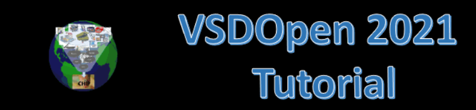

This is the report for the One Day Workshop on "VSDOpen21_FPGA_Workshop"

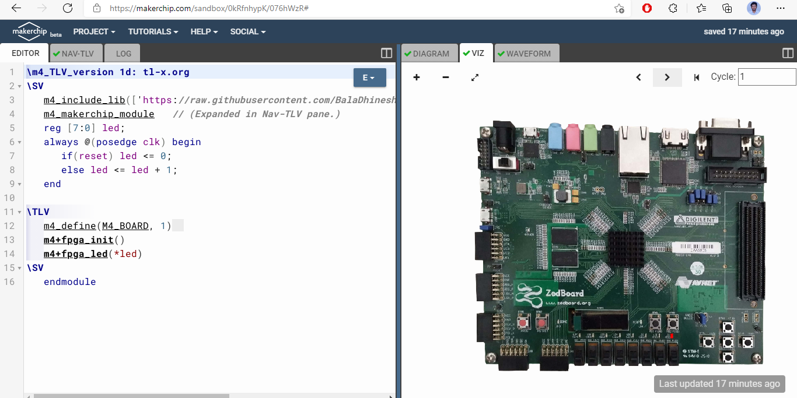
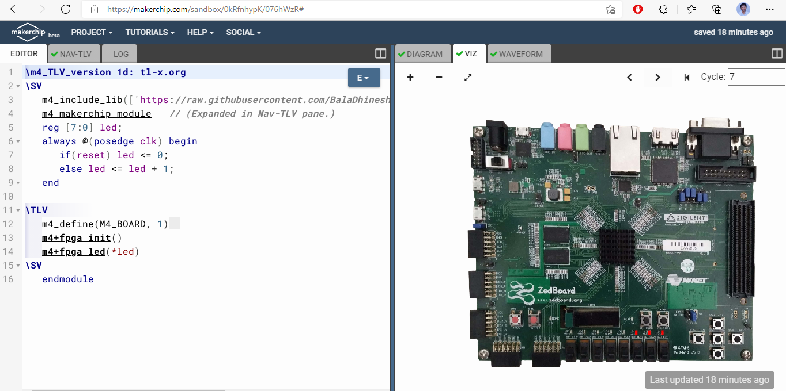
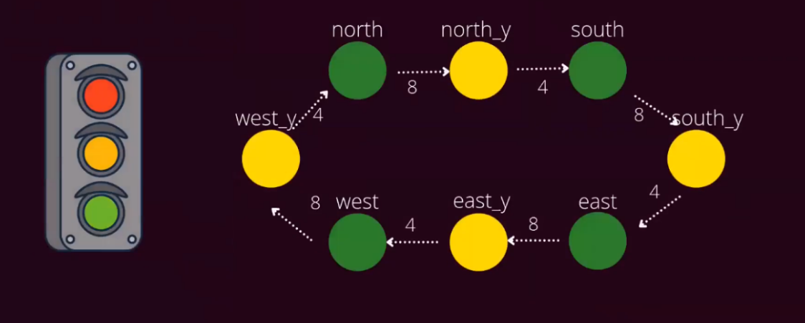
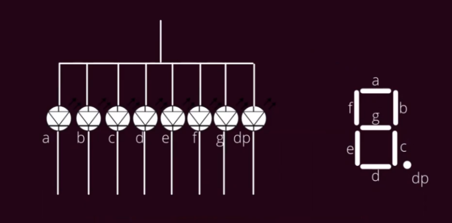
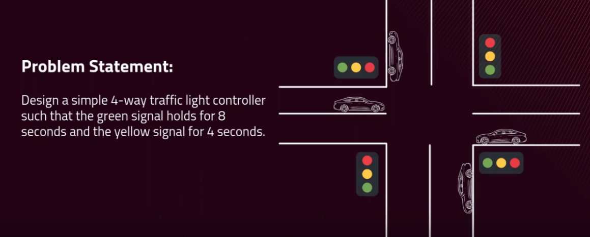
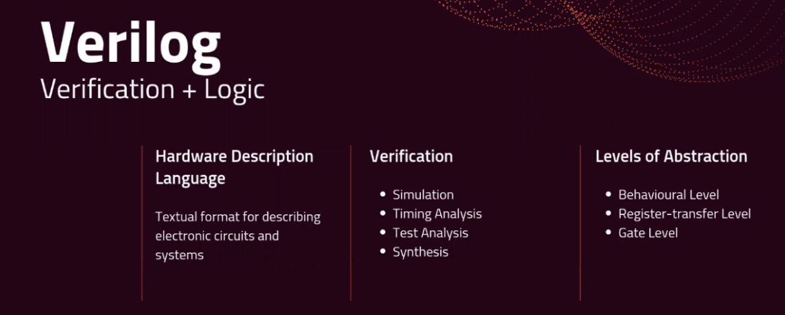
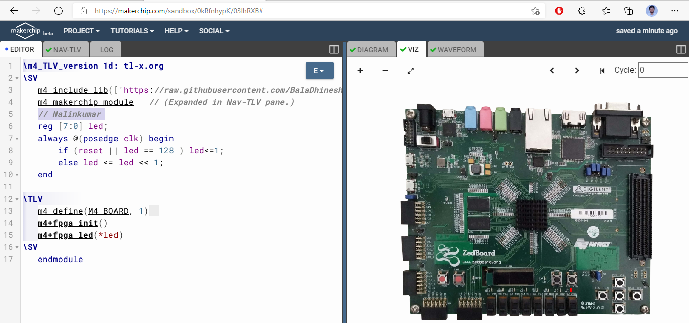
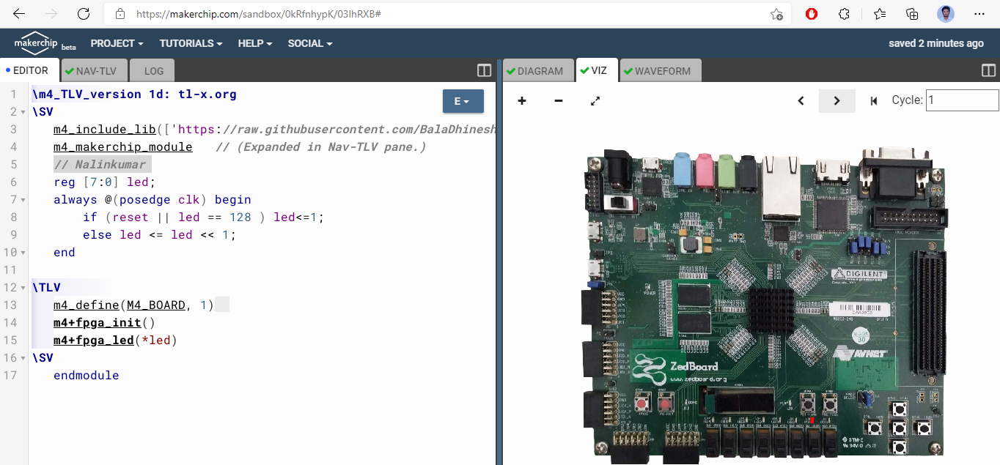
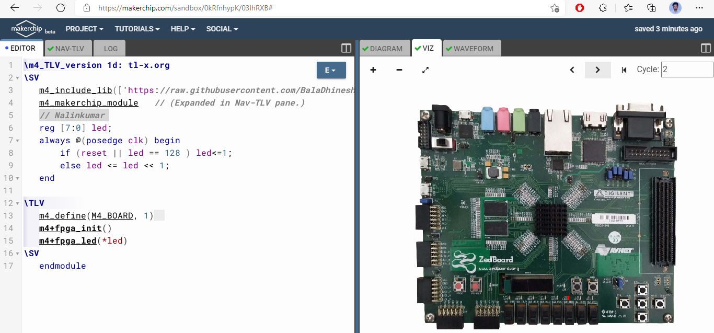
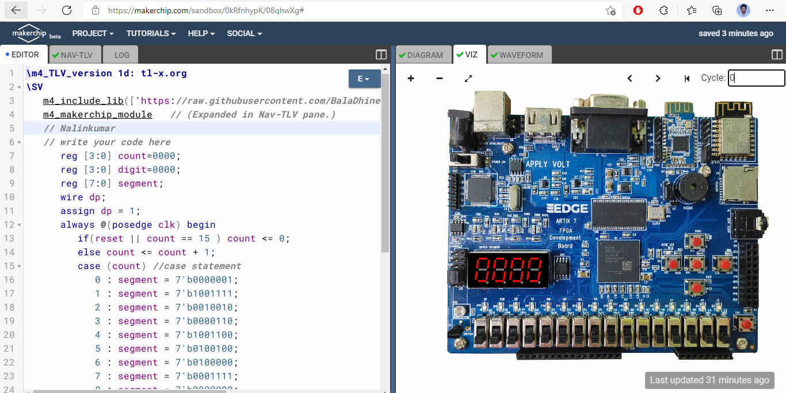
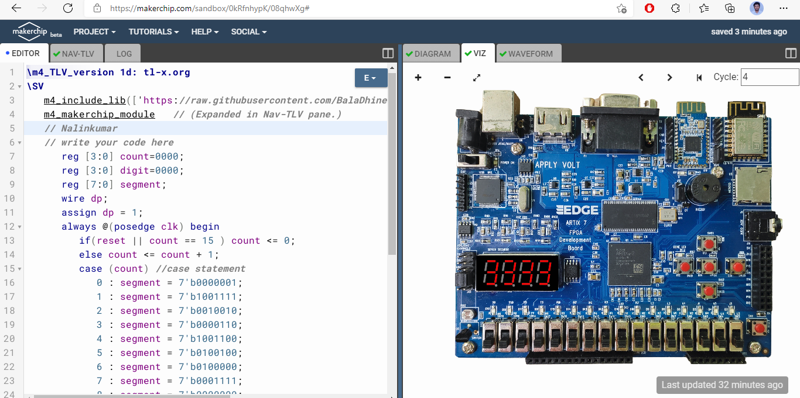
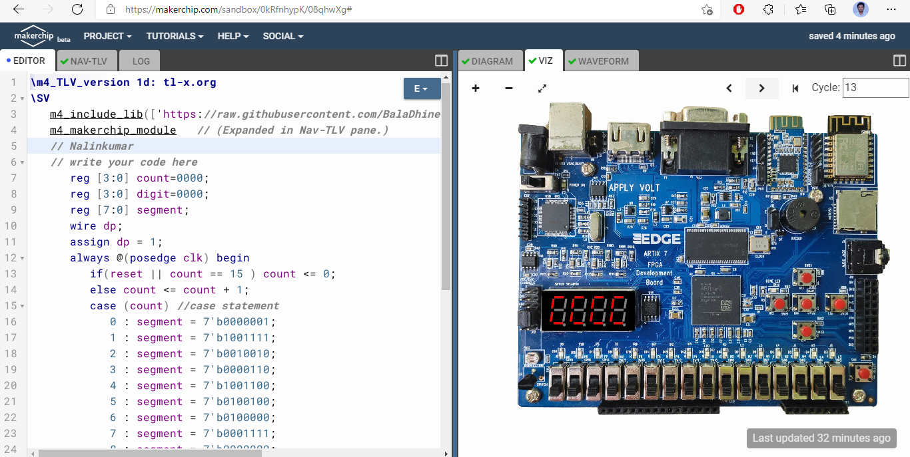
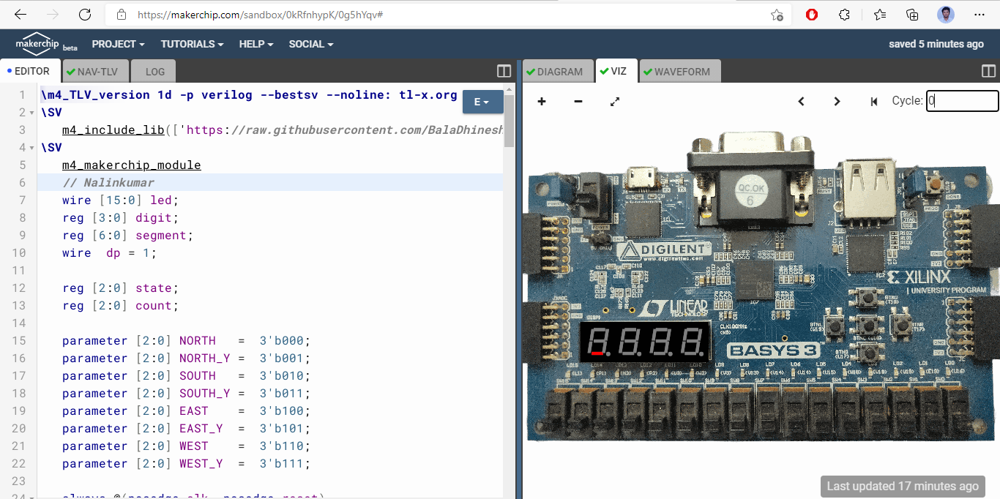

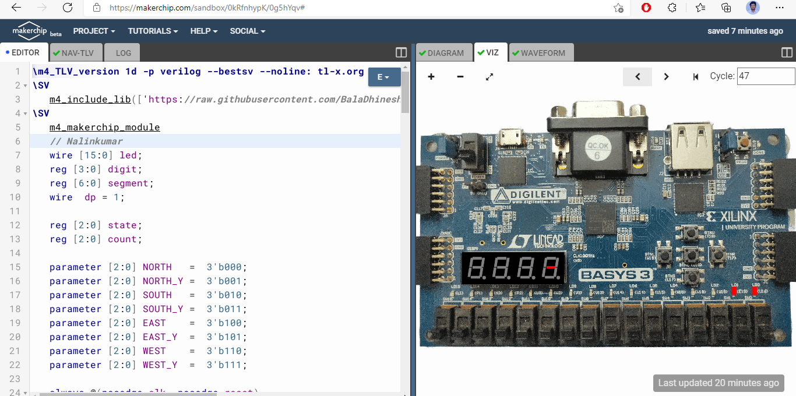

##  Report by 

🖊️  Nalinkumar S , B.E (Electronics and Communication Engineering), Madras Institute of Technology, Anna University, Tamil Nadu 

##  Acknowledgments

 - Kunal Ghosh, Co-founder, VSD Corp. Pvt. Ltd. - kunalpghosh@gmail.com
 - Bala Dhinesh, Undergrad, IIT Madras

##  References

- https://github.com/BalaDhinesh/Digital-Design-on-FPGA--VSDOpen21.git
